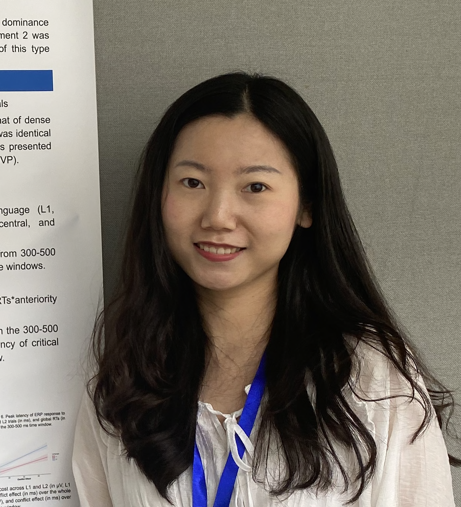

 
<!-- Profile picture -->

## About
I earned my PhD in Psychology from [Beijing Normal University](https://en.wikipedia.org/wiki/Beijing_Normal_University), specializing in psycholinguistics. Before that, I completed my MA in Teaching Chinese to Speakers of Other Languages at [Peking University](https://en.wikipedia.org/wiki/Peking_University), focusing on the processing of constructions among L2 Chinese learners. I also hold a BA from [Beijing Foreign Studies University](https://en.wikipedia.org/wiki/Beijing_Foreign_Studies_University), where I double-majored in Teaching Chinese as Foreign Language and English Language and Literature.
   

## Research interests
Psycholinguistics, Neurolinguistics, Bilingualism and Cognition, Second Language Acquisition
- Adaptability of bilingual language control
- Bilingual language control in emotional contexts
- Bilingual language control in ecologically valid naturalistic settings
- Interconnection between bilingual language control and cognitive control

## Ongoing projects 
- How does the bilingual language control system adapt to the textual contexts? (with Baoguo Chen) 
[Jiang, S., Ma, L., & Chen, B. (2024). The role of cognitive control in bilingual language comprehension: An event-related potential study of dense code-switching sentences. *Bilingualism: Language and Cognition, 27*(1), 137–153.](https://doi.org/10.1017/S1366728923000494)  
[Jiang, S., Ma, L., & Chen, B. (2023). Dynamic engagement of cognitive control in intra-sentential code-switching during comprehension. *Bilingualism: Language and Cognition, 26*(1), 62–77.](https://doi.org/10.1017/S1366728922000323) 
- How does the adaptive bilingual language control system operate in emotional contexts? (with Baoguo Chen) 
[Jiang, S., Meng, Y., & Chen, B. (2024). The impact of emotional states on bilingual language control in cued and voluntary switching contexts. *Journal of Memory and Language, 137*(19), 104527.](https://doi.org/10.1016/j.jml.2024.104527)
